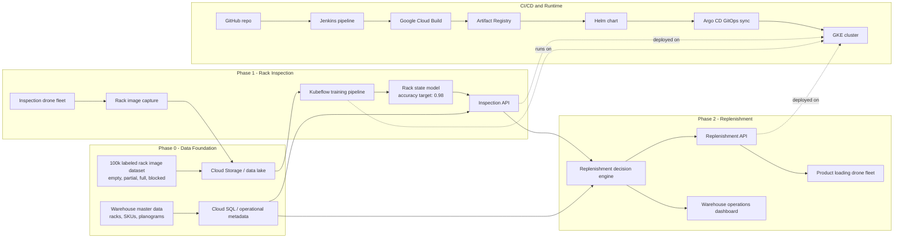

# Warehouse Drone AI

Warehouse automation planning package for drone-based rack inspection, replenishment decisioning, and phased grocery warehouse automation.

Start here: [docs/README.md](docs/README.md)

## Architecture



## Code Included

- Phase 0 sample master data under `data/sample`.
- Phase 1 dataset generation, model training, inference, and inspection API.
- Phase 2 replenishment decision engine and API.
- Local Phase 0-1-2 pipeline under `scripts/run_local_pipeline.py`.
- Terraform starter for GCP Cloud SQL and object storage.
- Helm/Kubernetes deployment chart for inspection and replenishment services.
- Argo CD application manifest and GKE deployment guide.
- Jenkins pipeline for CI/CD deployment.

## Run Locally

```powershell
python scripts\smoke_test.py
python scripts\run_local_pipeline.py
```

The default local pipeline now uses a 100k labeled MVP dataset scale:

```text
dataset_records: 100000
target_accuracy: 0.98
test_accuracy: 1.0 on the synthetic starter dataset
target_met: True
```

Dataset tiers are defined in `ml/src/config.py`:

```text
demo: 250
mvp: 10000
mvp_100k: 100000
production: 200000
enterprise: 500000
```

The `1.0` test score is only for the synthetic starter data. For real warehouse images, the model must be validated on held-out labeled images from the pilot zone before claiming production accuracy.

Install API dependencies when you want to run the FastAPI services:

```powershell
pip install -r requirements.txt
uvicorn services.inspection_api.app:app --reload --port 8000
uvicorn services.replenishment_api.app:app --reload --port 8001
```

## Deploy

Hands-on deployment guide:

[docs/deployment/README.md](docs/deployment/README.md)
